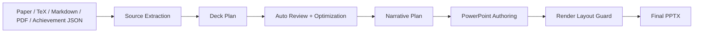

# Theory Physics PPT

`theory-physics-ppt` is a Codex skill for turning papers and research materials into academically structured presentation plans for:

- conference talks
- assessment / review PPTs
- group meetings and journal clubs

It is built for theory-physics workflows where the hard part is not just drawing slides, but deciding:

- what the scientific narrative should be
- how much background to keep for a given audience
- which figures and equations deserve slide space
- where local citations are required
- how to keep the final deck readable instead of overcrowded

The skill plans and reviews the deck first, then hands final `.pptx` authoring to the PowerPoint workflow.

## Why This Skill Exists

Most slide generators are good at making slides look presentable, but weak at reading a theory paper like a real talk:

- they summarize sections instead of organizing a spoken argument
- they ignore citation locality
- they do not distinguish conference / assessment / group-meeting logic
- they overload slides with paper text
- they rarely respect an existing academic PPT template cleanly

This skill is designed to solve those problems.

## What It Does

- Extract structure from TeX/arXiv source, Markdown, PDF, or achievement summaries
- Build a slide-by-slide narrative plan rather than a generic summary
- Assign timing, density, and visual roles to each slide
- Recover lightweight formalism chains from TeX/arXiv source
- Generate local citation expectations for non-original content
- Review and compress overloaded slides before authoring
- Enforce a render-level layout guard so wrapped text does not overflow or collide
- Support both template-free and template-driven style workflows

## Input Priority

For paper-like sources, use this order whenever possible:

1. TeX or arXiv source
2. Clean Markdown conversion
3. PDF only as fallback

Supported inputs:

- local `.pdf`
- local `.md`
- local `.tex`
- directory of LaTeX sources
- `.zip`, `.tar`, `.tar.gz`, `.tgz` LaTeX source archive
- achievement JSON for assessment / review decks

## Style Modes

The skill supports three style modes. In practice, you only need one simple rule:

- no template and no strong visual requirement: use `builtin`
- must match an existing `.pptx`: use `template`
- want fallback behavior and do not want to decide: use `auto`

| Mode | Best for | Template required? | Recommendation |
| --- | --- | --- | --- |
| `builtin` | First-time users, public release, quick academic output | No | Recommended default |
| `template` | Personal / group / university / defense / conference `.pptx` styles | Yes | Use when visual continuity matters |
| `auto` | Local workflows where fallback is convenient | Optional | Use when you are okay with implicit selection |

For public release, this skill should be treated as template-free by default.
Users who want their own style can either:

- pass `--template /absolute/path/to/your-template.pptx`
- or place their `.pptx` in a local `templates/` folder in the workspace

## Workflow At A Glance



## Quick Start

### 1. Template-free default

This is the most stable starting point and the recommended default for most users:

```bash
python3 scripts/run_ppt_workflow.py \
  --input /absolute/path/to/paper-source \
  --deck-type group-meeting \
  --minutes 35 \
  --language en \
  --audience experts \
  --style-mode builtin \
  --presenter-name "Your Name" \
  --presenter-affiliation "Your Institute" \
  --output-dir outputs/my-talk
```

### 2. Use a custom `.pptx` template

Use this when the deck should match an existing lab, university, or personal PowerPoint style:

```bash
python3 scripts/run_ppt_workflow.py \
  --input /absolute/path/to/paper-source \
  --deck-type conference \
  --minutes 20 \
  --language en \
  --audience mixed \
  --style-mode template \
  --template /absolute/path/to/your-template.pptx \
  --presenter-name "Your Name" \
  --presenter-affiliation "Your Institute" \
  --output-dir outputs/my-conference-talk
```

### 3. Inspect a custom template first

If you want to see what the skill can recover from a user-supplied `.pptx`, inspect it first:

```bash
python3 scripts/profile_ppt_template.py \
  --input /absolute/path/to/your-template.pptx \
  --deck-type group-meeting \
  --language en \
  --output outputs/template_profile.json
```

## What The Workflow Produces

- `source_summary.json`
- `deck_plan.json`
- `deck_review.json`
- `deck_review.md`
- `narrative_plan.md`

These are planning artifacts. They are then consumed by the PowerPoint authoring workflow to produce the final deck.

## Repository Layout

- [SKILL.md](./SKILL.md): core skill definition and agent-facing rules
- [agents/openai.yaml](./agents/openai.yaml): UI metadata
- [scripts/](./scripts): extraction, planning, review, packaging, template profiling, and layout-guard tooling
- [references/workflow.md](./references/workflow.md): practical workflow and style-mode selection guide
- [references/input_formats.md](./references/input_formats.md): supported source types and metadata shapes
- [templates/](./templates): optional workspace folder for user-provided `.pptx` templates

## Current Strengths

- TeX/arXiv-aware extraction of sections, symbols, and lightweight formalism chains
- Different planning logic for conference, assessment, and group-meeting decks
- Citation-aware slide planning
- Blue-emphasis term generation and rendering guidance
- Render-level overflow / collision checks
- Dual style support: built-in academic style or custom `.pptx`

## Current Limits

- PDF-only extraction remains the weakest input path
- Custom template profiling is intentionally lightweight and does not fully understand arbitrary PowerPoint masters semantically
- Final scientific judgment still benefits from a human pass, especially for dense or highly technical papers

## Release Notes

The repository includes a clean release packager:

- [scripts/package_skill_release.py](./scripts/package_skill_release.py)

It produces:

- a clean uploadable skill directory
- a zip archive suitable for GitHub releases or a skill marketplace upload

## Copyright

Copyright (c) 2026 Jinhui Guo. All rights reserved.  
License: Proprietary
